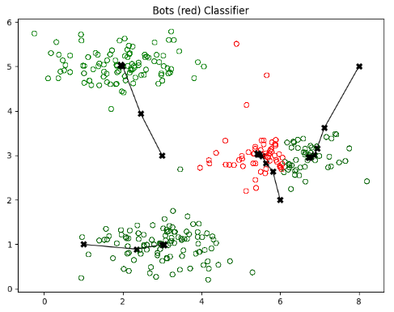
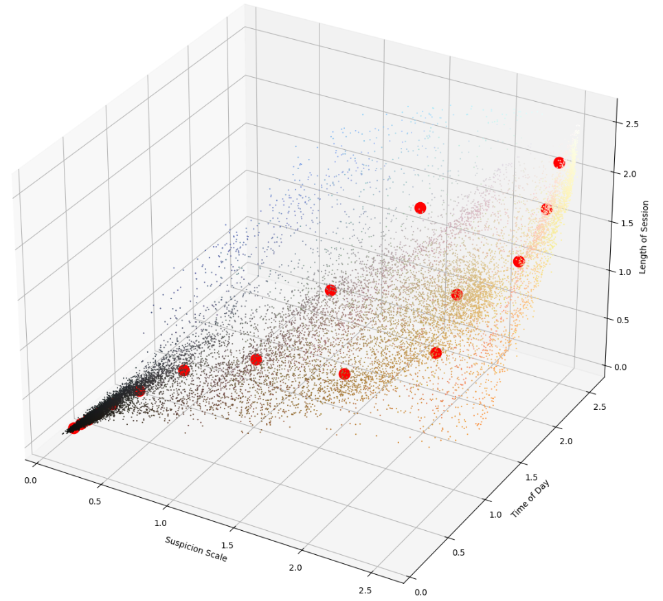

  

      <ul class="nav">
          <li><a href="relheg.html">prev</a></li>          
          <li><a href="{{ BASE_PATH }}/jshah-public.pdf">cv</a></li>
          <li><a href="https://github.com/javedmshah">github</a></li>
          <li><a href="https://linkedin.com/in/javedmaqboolshah">LinkedIn</a></li>
          <li><a href="emotion_agency.html">next</a></li>          
      </ul>
  

#### Detecting Scalper Bots using Unsupervised Learning
 

Presented here is an initial effort at modeling bot session durations for a popular social media site. The clusters shown here represent session durations in minutes along the Y axis and a coded time of day along the X axis. In the preliminary model and with limited data, we can see outlier values corresponding to known malicious attempts.  

Each point is a session representing authentication attempts collected over several months for time of day, session duration and likelihood of bot like activity. The red dots are centroids after running K-means.  

**Modeling the session behavior of bots**. &mdash;  
With the emergence of web 3.0, and scarce online products (NFTs, tickets, etc)  the constant threat of scalper bots poses a significant threat, often acquiring high-demand assets en masse for resale at inflated prices. This study proposes the use of unsupervised machine learning techniques in a pipeline model, starting primarily with K-means clustering and progressing to regression for feature significance, ultimately to identify and differentiate between human users and scalper bots based on their activity patterns over days and weeks.

We will collect and analyze session data and authentication attempts from a popular web 3.0 platform. The data includes timestamps of login attempts, session durations, frequency of visits, and transaction behaviors. We will perform feature engineering to allow for polynomial fitting of behaviors. Our hypothesis is that bots exhibit distinct patterns in terms of session frequency, duration, and transaction activities compared to genuine users, especially during product scarcity periods.

K-means clustering will be employed to segment users into clusters based on their activity patterns. We expect to identify clusters with high-frequency, short-duration sessions, and rapid transaction attempts, typical characteristics of scalper bots. Additional unsupervised methods like Hierarchical Clustering and Principal Component Analysis (PCA) will be used for data dimensionality reduction and to validate the robustness of the identified clusters.

The outcome of this research aims to provide web 3.0 platforms with a data-driven approach to detect and mitigate scalper bot activities, ensuring fair scarce-asset distribution and enhancing user experience.
