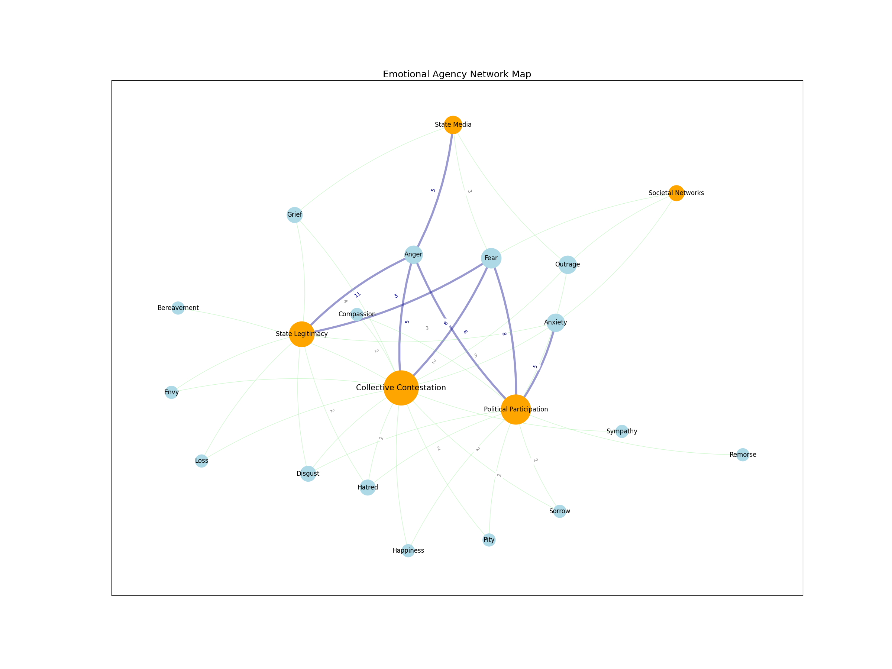
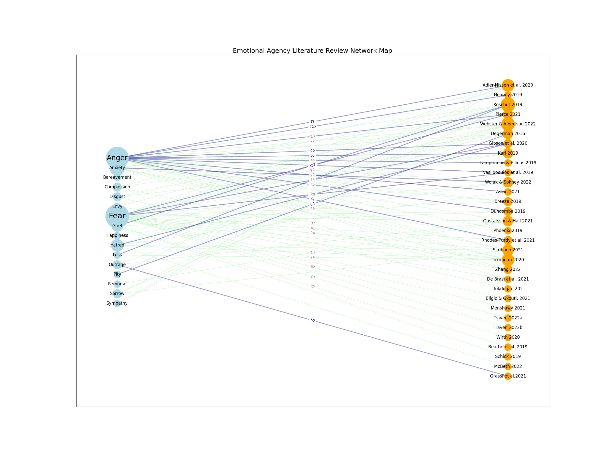

  

      <ul class="nav">
          <li><a href="triggers.html">prev</a></li>          
          <li><a href="{{ BASE_PATH }}/jshah-public.pdf">cv</a></li>
          <li><a href="https://github.com/javedmshah">github</a></li>
          <li><a href="https://linkedin.com/in/javedmaqboolshah">LinkedIn</a></li>
          <li><a href="gtfeature.html">next</a></li>          
      </ul>
  

#### Emotion Agency in Politics
 <a href="https://journals.sagepub.com/doi/10.1177/00208345241232769">Shah, T. M. (2024). Emotions in Politics: A Review of Contemporary Perspectives and Trends</a>  
International Political Science Abstracts, 74(1), 1-14 
<a href="{{ BASE_PATH }}/shah-2024-emotions-in-politics-a-review-of-contemporary-perspectives-and-trends.pdf"><direct download link></a>  

**Feature Agency Network Graph**. &mdash;  
The multi-layered process of emotions in the everyday is depicted through a network of interconnected nodes and relationships across four dominant themes: collective contestation, political participation, state legitimacy, state’s use of media to project a national identity. Emotions, embodied within individuals and collectively held, weave through the nodes of societal structures, affecting perceptions, and actions within global politics. The arches represent the number of articles that explore specific emotions, such as anger, reflecting the prevalence of certain emotions within each theme.

Model specifics: Using NetworkX, a Python package for graphing networks, I constructed a model that emphasized the dominant themes using a force-directed layout weighted by the effect sizes of each coded feature within these themes. A undirected weighted graph was created using nodes computed from each feature and theme and weighted by the effect size. A Kamada Kawai layout was used to plot the relationships between the dominant themes and features. This layout leverages the geometric distance between two vertices in the graph and converts it to the graph theoretic distance creating a spring algorithm for good symmetric structure with relatively small edge crossings in an otherwise highly connected graph.

**Feature extraction (emotions) from Sociological studies**. &mdash;  

Model specifics: Also modeled were the dominant themes weighted by the effect sizes for each of the coded features that were evaluated within the dominant themes in the thirty one studies surveyed. A directed weighted graph was constructed with nodes representing each of the studies connected to specific features, with the connections weighted by the effect sizes - combining word counts with contextual weighting. I utilized a multipartite layout to visually highlight the relationship between dominant features and the studies discussing them.

[github: computational model for emotions in politics](https://github.com/javedmshah/compute.agency.model){:target="_blank"}
