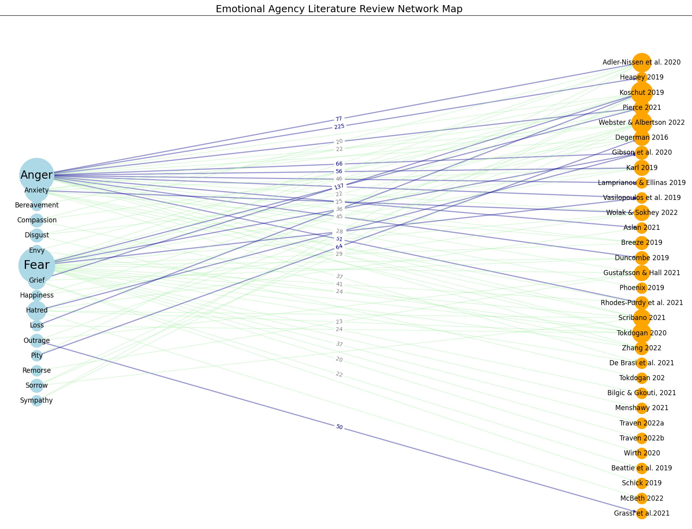

  

      <ul class="nav">
          <li><a href="{{ BASE_PATH }}/jshah-public.pdf">cv</a></li>
          <li><a href="https://github.com/javedmshah">github</a></li>
          <li><a href="https://linkedin.com/in/javedmaqboolshah">LinkedIn</a></li>
      </ul>
  

"Emotion in Politics", International Political Science Abstracts, (IPSA 2024)  
by Shah, Dr. Tamanna, Assistant Professor of Instruction, Ohio University  
Shah, Javed - contributing to model generation using NetworkX libraries in Python   

**Emotion Agency Network Graph**. &mdash;  

**Literature Review for Emotion in Politics**. &mdash;  
