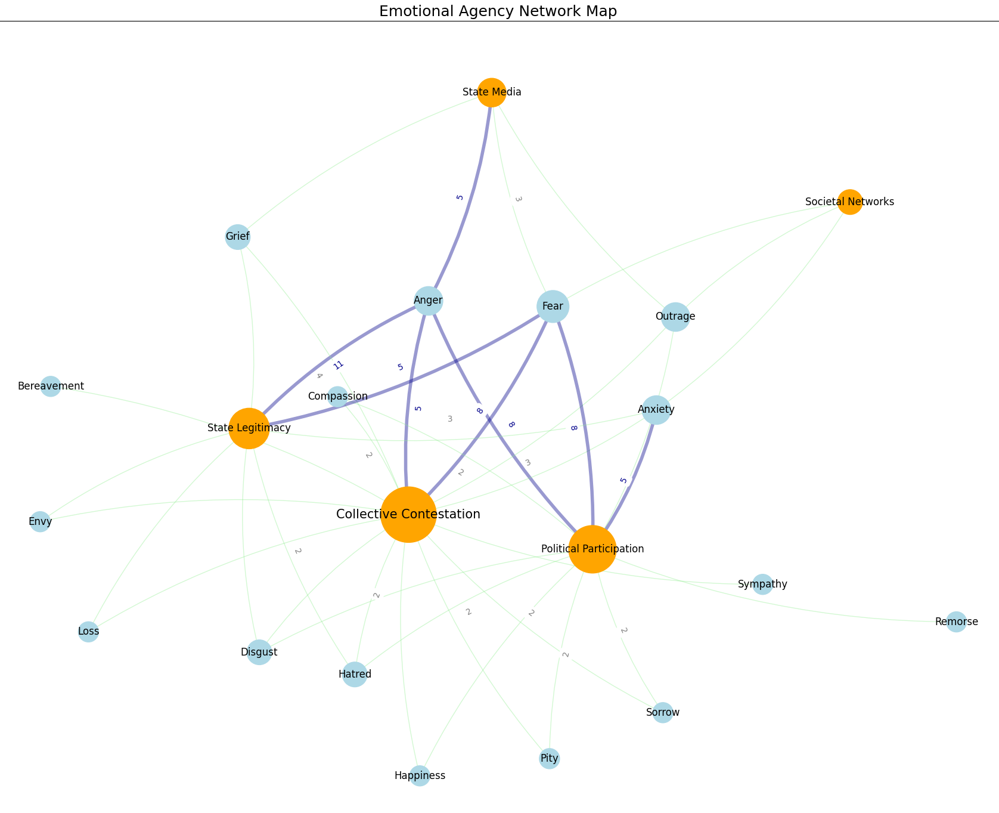

  

      <ul class="nav">
          <li><a href="{{ BASE_PATH }}/jshah-public.pdf">cv</a></li>
          <li><a href="https://github.com/javedmshah">github</a></li>
          <li><a href="https://linkedin.com/in/javedmaqboolshah">LinkedIn</a></li>
      </ul>
  

"Emotion in Politics", International Political Science Abstracts, (IPSA 2024)  
by Shah, Dr. Tamanna, Assistant Professor of Instruction, Ohio University  
Shah, Javed - contributing to model generation using NetworkX libraries in Python   

**Emotion Agency Network Graph**. &mdash;  
The multi-layered process of emotions in the everyday is depicted through a network of interconnected nodes and relationships across four dominant themes: collective contestation, political participation, state legitimacy, state’s use of media to project a national identity. Emotions, embodied within individuals and collectively held, weave through the nodes of societal structures, affecting perceptions, and actions within global politics. The arches represent the number of articles that explore specific emotions, such as anger, reflecting the prevalence of certain emotions within each theme.

Model specifics: Using NetworkX, a Python package for graphing networks, we modeled the dominant themes using a force-directed layout weighted by the frequency of emotions discussed in the 36 studies that were surveyed. A undirected weighted graph was created using nodes computed from each emotion and theme and weighted by the effect size. A Kamada Kawai layout was used to plot the relationships between the dominant themes and emotions. This layout leverages the geometric distance between two vertices in the graph and converts it to the graph theoretic distance creating a spring algorithm for good symmetric structure with relatively small edge crossings in an otherwise highly connected graph.

**Literature Review for Emotion in Politics**. &mdash;  

Model specifics: Using NetworkX, we modeled the dominant themes weighted by the effect sizes for each of the coded emotions that were valuated within the dominant themes in the 36 studies that were surveyed. A directed weighted graph was created using nodes computed for each of the 36 studies and connected to emotions weighted by the effect sizes - contextual weighting was used in addition to word counts. A multipartite layout was used to emphasize dominant emotions on the one side and the specific studies that discussed them on the other side, weighted by the contextualy computed effect sizes.
