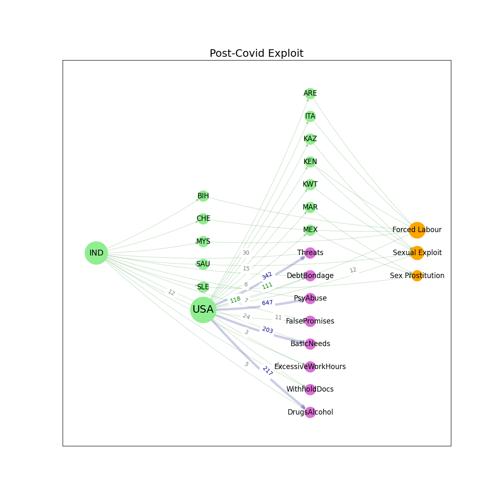

  

      <ul class="nav">
          <li><a href="triggers.html">prev</a></li>          
          <li><a href="{{ BASE_PATH }}/jshah-public.pdf">cv</a></li>
          <li><a href="https://github.com/javedmshah">github</a></li>
          <li><a href="https://linkedin.com/in/javedmaqboolshah">LinkedIn</a></li>
          <li><a href="emotion_agency.html">next</a></li>          
      </ul>
  

#### Surveying exploitation of labor in the aftermath of Covid19

**Study of trafficking dynamics**. &mdash;  
The COVID-19 pandemic has disproportionately affected marginalized communities and
exacerbated socio-economic vulnerabilities, thereby increasing the risk of human trafficking. This
systematic literature review examined the impact of the pandemic on human trafficking in
India and the US, focusing on trends, vulnerabilities, and victim profiles during and post-
pandemic periods. We conducted quantitative analysis of trends from the Counter-Trafficking Data Collaborative (CTDC) Global K-anon Dataset, version 20210825.
The scope of this research is focused on analyzing the transformation in trafficking dynamics due to the pandemic. It assesses how victim profiles have diversified, methods of trafficking have evolved, and exploitation has intensified or changed in nature due to altered social and economic conditions. By doing so, the paper contributes to a nuanced understanding of the intersection between a global health crisis and human trafficking, offering insights to inform policies and interventions.    
***Post COVID sub-exploitation map using a multipartite graph*** 
Using the CTDC data, which includes anonymized data on identified trafficking cases, we mapped victim profiles by country of citizenship, trafficking routes, and exploitation types. Data was stratified by country, victim demographics, type of trafficking, and outcomes to provide a comparative insight into the prevalence and characteristics of trafficking in the United States and India.  
  
We highlighted contextual differences and the shared challenges faced by both countries, underscoring the need for adaptive strategies and innovative solutions to combat human trafficking effectively. We organized the data by country of citizenship, and mapped all the cases of exploitation to USA and India. Further, we aggregated the major themes and counted all cases up to and just before the covid outbreak, and separately, after the outbreak. The data also included the means of exploitation, such as false promises, denial of basic needs, etc. Presented here in a multipartite graphical model is the subset with the highest frequencies in the original dataset.    
***Post COVID global exploitation map*** 
This research also explores specific changes in trafficking patterns in India and the USA, highlighting how the pandemic has shifted victim profiles, trafficking methods, and exploitation types. The research aims to uncover how these shifts have resulted from pandemic-induced vulnerabilities and the opportunistic adaptations by traffickers exploiting these conditions. The unique conditions created by the COVID-19 pandemic have provided
an opportunity to examine how legislative frameworks in both countries have responded to the pandemic's challenges related to human trafficking. We mapped out the relative density of human trafficking between all the countries studied, weighted by the number of people that were exploited. The study acknowledges potential limitations, including variability in the data quality and availability between the United States and India, and the challenges of interpreting legal texts from different legal systems.
  

**Analysis** 
We wrote an analysis script in Python that was used for constructing and visualizing directed graphs (DiGraphs) using the NetworkX library, specifically in the context of analyzing exploits before and after the Covid pandemic. The analysis focuses on relationships between certain entities or nodes represented by source country, destination country, means of exploitation and primary category of exploit. We built a network graph that has edges weighted by the respective counts of trafficking that actually took place.
***Key Components of the Analysis*** 
Graph construction: 
Two separate directed graphs, G_subexploits_from and G_exploits_post, are constructed. Nodes in these graphs represent entities involved in human trafficking, and edges represent the relationships between these entities, weighted by the instances of exploitation. G_subexploits_from is created by iterating over a list of source countries, and edges are added from source to a sub-exploit pandas dataframe if the corresponding instance count is non-zero. G_exploits_post is similarly constructed but involves a relationship from source countries to target entries and also relates the target with the type of human trafficking involved, with similar conditions on the instance count.
Graph Merging: 
The two graphs are merged into a single graph using nx.compose, which effectively combines all nodes and edges from both input digraphs, maintaining the integrity of edge attributes. Each node in the graph is assigned a class attribute based on its degree, providing a simple metric of node centrality or importance based on connectivity.
Visualization: 
The combined graph is visualized using a multipartite layout, which organizes nodes into horizontal layers. This layout is determined by topological generations, indicating different levels or stages of connectivity (e.g., initial exploits vs. subsequent ones).
Nodes and edges are customized in terms of size, color, and style based on their degree and other attributes, enhancing readability and insight into the structure of the graph.

***Analytical Implications and Research Insights*** 
Exploit Dynamics:  By analyzing the directed relationships and flow between entities, we are able to infer patterns or trends in exploit behavior, particularly in the post-Covid context.
Entity Role Analysis:  Classification based on node degree helps identify key players or bottlenecks in the exploit networks, which could be critical targets for security measures or further analytical probing.
Visualization as a Tool:  Effective visualization aids in the intuitive understanding of complex networks. The use of the multipartite layout helps distinguish between different levels of action within the network, providing clear visual segmentation of stages or phases in the exploit chain.
Methodological Considerations
Data Handling:  The script assumes non-empty instance counts, which may require preliminary data cleaning or validation to handle missing or anomalous data effectively.
Graph Complexity:  As the size of the input lists (source-country, target-country, exploit-map) grows, the computational complexity for graph construction and visualization also increases, potentially requiring optimization or more efficient data structures if scalability is a concern.
Statistical Robustness:  Further statistical analysis might be needed to support hypotheses generated from visual insights or node classifications, such as correlation studies or predictive modeling based on graph metrics. 

In summary, the Python script uses the popular NetworkX graphing library and is structured to provide a foundational approach for analyzing and visualizing directed relationships in a computational research context, offering insights into how entities interact within exploit networks before and after the Covid outbreak. This kind of analysis is crucial for developing strategies to mitigate future exploits and understanding the dynamics of such networks in a changing global landscape.
