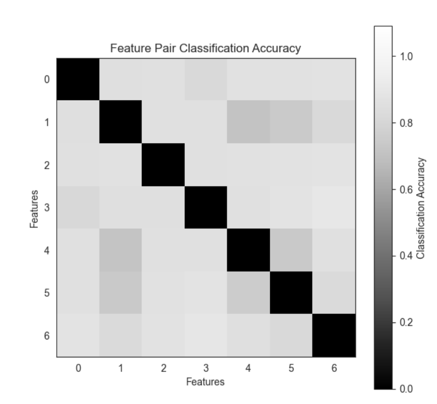

  

      <ul class="nav">
          <li><a href="relheg.html">prev</a></li>          
          <li><a href="{{ BASE_PATH }}/jshah-public.pdf">cv</a></li>
          <li><a href="https://github.com/javedmshah">github</a></li>
          <li><a href="https://linkedin.com/in/javedmaqboolshah">LinkedIn</a></li>
          <li><a href="emotion_agency.html">next</a></li>          
      </ul>
  

#### Game theory for feature analysis in learning models
***working paper***
The research is in early stages, but focuses on calculating payoff matrices for factor analysis. We try to derive how each 'player' (in this case, each feature of a dataset) competes or cooperates with others to achieve a goal, such as explaining variance in the data. The 'payoff' is quantified based on the contribution of each feature to this goal. To emphasize the game-theoretic nature of the problem, we visualize the payoff matrix and Nash Equilibrium, if we can find one. Additionally, we  plot the accuracies of each feature pair to understand their contributions better. The payoff for each feature in the sample dataset is based on how well it can classify or separate the data when combined with other features. It is unclear as to the predictive power of this approach but we believe it holds potential using simple classification accuracy as a proxy to start with.
***Approach***  
Compute the payoff matrix using classification accuracy between pairs of features from the dataset. 
Create a game using the nashpy library and find Nash Equilibria. 
Plot the payoff matrices, showing how each feature pair's classification accuracy (payoff) relates to each other. 
Visualize feature pair classification accuracy as a heatmap for a more intuitive understanding of how well each pair performs. 
Plot the first Nash Equilibrium (if one exists), illustrating the balance point where neither player ("feature") can benefit by unilaterally changing their strategy. We believe this carries some potential for determining a pairwise strategy for inclusion of said features for a learning model.  

**Payoff matrix using decision classifiers**. &mdash;  
The payoff matrix here represents how well each pair of features works together to classify the data. A higher score indicates a better combination for classification. 

**Pairwise significance using classification accuracy heatmap**. &mdash;  
Feature pair classification accuracy is used as a heatmap gauging pairwise performance. 

**Nash equilibrium for feature pairing**. &mdash;  
We expect the application of game theory in factor analysis to be complex and context-dependent. These plots provide a visual and simplified understanding of how game theory might apply to feature selection or analysis in a dataset. Real-world testing is on the roadmap. 
