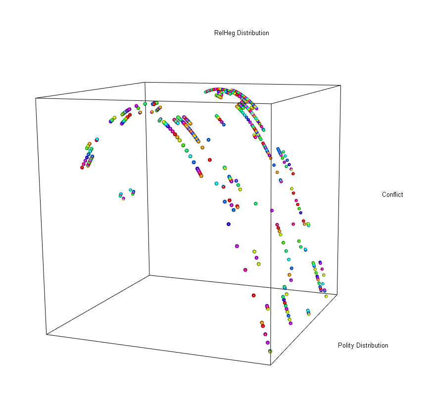

  

      <ul class="nav">
          <li><a href="emotion_agency.html">prev</a></li>          
          <li><a href="{{ BASE_PATH }}/jshah-public.pdf">cv</a></li>
          <li><a href="https://github.com/javedmshah">github</a></li>
          <li><a href="https://linkedin.com/in/javedmaqboolshah">LinkedIn</a></li>
          <li><a href="gtfeature.html">next</a></li>          
      </ul>
  

#### Generalized Linear Models for computational sociology
***working paper***

**3D Generalized Linear Model for Distributed Sociological Phenomenon**. &mdash;  
The relationships between conflict and normal distributions of religious hegemony and polity using z-score scaled features. The curvilinear model in three dimensions shows the causal effects of changing political regimes on societal conflict.

**Mixed Effects and Fixed Effects Logistics Model**. &mdash;  
Mixed model analysis was used by related studies on social conflict and religious hegemony to provide generalized and flexible approaches to document the effects of regime on conflict. The logistic fixed effects model created in this research confirms the robustness of the results from the mixed effects models. The fixed effects model demonstrates changes in the directionality and significance levels of some of the control variables. The inverted U-shape curve or the nonlinear effect confirms earlier findings and adds credence to theory of religious hegemony as being related to changing political institutions, and also as being causal in nature to conflict.

[github: GLMs for computational sociology](https://github.com/javedmshah/compute.glm.model){:target="_blank"}
