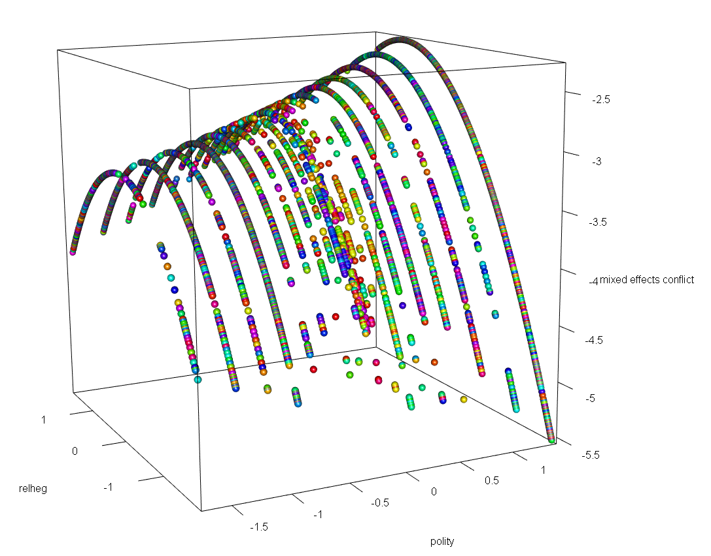
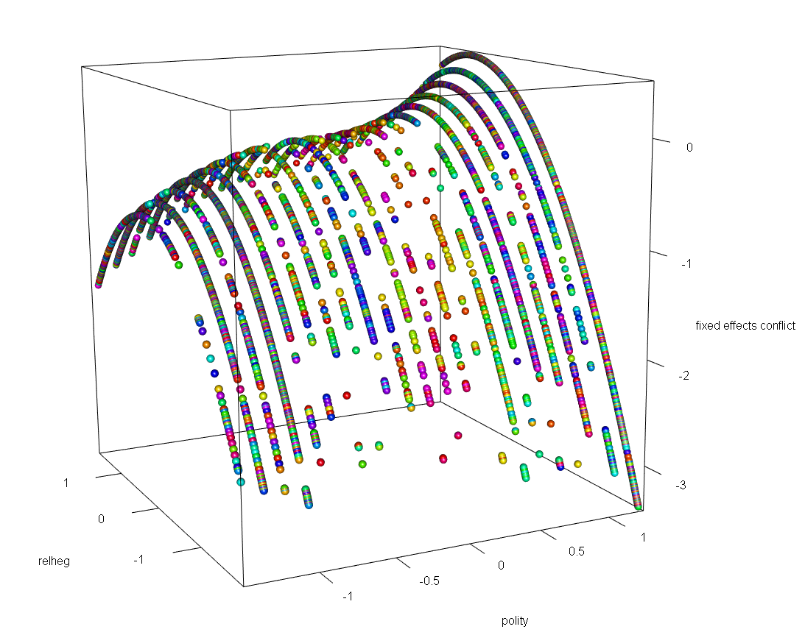

  

      <ul class="nav">
          <li><a href="gtfeature.html">prev</a></li>          
          <li><a href="{{ BASE_PATH }}/jshah-public.pdf">cv</a></li>
          <li><a href="https://github.com/javedmshah">github</a></li>
          <li><a href="https://linkedin.com/in/javedmaqboolshah">LinkedIn</a></li>
          <li><a href="bots.html">next</a></li>          
      </ul>
  

#### Generalized Linear Models for computational sociology
***working paper***

**Mixed Effects Modeling for Distributed Sociological Phenomenon**. &mdash;  
Our mixed effects model shows a curvilinear relationship of religious hegemony as a fixed effect and accounts for random differences between polity levels. We captured the relationships between conflict and religious hegemony and polity  using z-score scaled features. The curvilinear model in three dimensions shows the causal effects of changing political regimes on societal conflict. The fixed effects part is interpreted like a standard regression (average within-entity effect), while the random effects account for variation between entities.

**Fixed Effects Modeling for Distributed Sociological Phenomenon**. &mdash;  
We also used a fixed effects model for creating a concept of religious hegemony based on more than just the traditional binary representation found in existing literature. We used ideology, culture and polity among other discrete variables, and analyzed their impact over time. Fixed effects models control for all time-invariant differences between entities, so we are essentially comparing conflict as modeled against religious hegemony over time. 

**Our hypothesis for explaining Conflict**. &mdash;  
Mixed model analysis was used by related studies on social conflict and religious hegemony to provide generalized and flexible approaches to document the effects of regime on conflict. The logistic models created in this research confirms the robustness of the results. The fixed effects model demonstrates changes in the directionality and significance levels of some of the control variables. The inverted U-shape curve or the nonlinear effect confirms earlier findings and adds credence to theory of religious hegemony as being related to changing political institutions, and also as being causal in nature to conflict. We confirmed the relationship using a random effects model that showed a generalized average of the hypothesized relationship between conflict and religious hegemony with both within-entity and between-entity analyses.

[github: GLMs for computational sociology](https://github.com/javedmshah/compute.glm.model){:target="_blank"}
