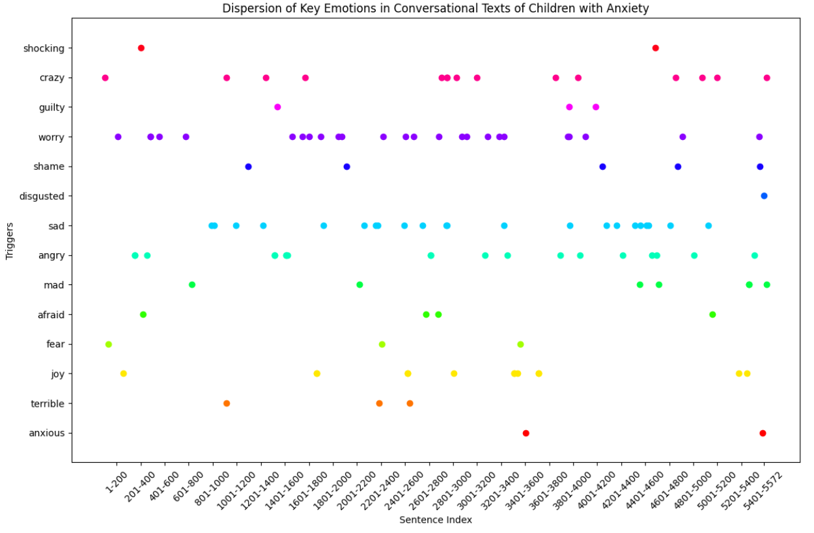
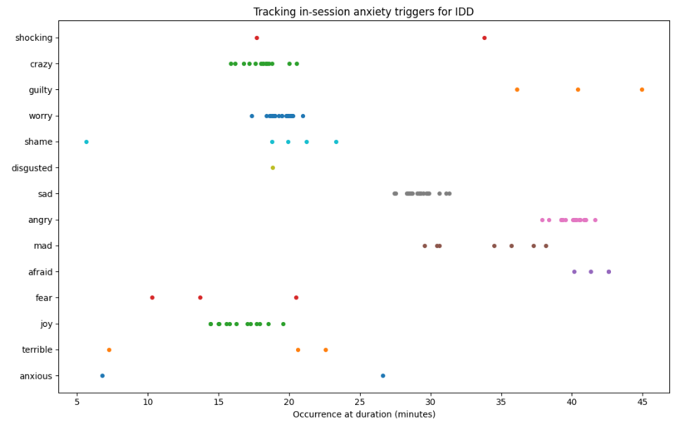

  

      <ul class="nav">
          <li><a href="bots.html">prev</a></li>          
          <li><a href="{{ BASE_PATH }}/jshah-public.pdf">cv</a></li>
          <li><a href="https://github.com/javedmshah">github</a></li>
          <li><a href="https://linkedin.com/in/javedmaqboolshah">LinkedIn</a></li>
          <li><a href="emotion_agency.html">next</a></li>          
      </ul>
  

#### Emotional dynamics and behavioral change detection with NLP

**Using NLP to track anxiety triggers in conversational text**. &mdash;   
***Visualizing Anxiety Triggers*** 
We distributed emotion occurrences across sentences, plotting each occurrence to reflect its dispersion through the sequence of sentences. We wrote a Python script that simulates a dispersion plot where each dot represents an occurrence of an emotion within a specific unit of analysis in the corpus. It visually illustrates how emotions are distributed throughout the conversation, assuming a one-to-one mapping between sentences and rows in the vectorized array.  
  

We used the popular sklearn's CountVectorizer for feature extraction on a correspondence text corpus that gave us vectorized sentences with summed individual occurrences of an emotion in each sentence. We used this emotion-vocabulary based vectorizer to simulate a dispersion plot by assuming the position of each emotion word occurrence is indicative of its presence in the sentence sequence of the corpus. This approach gives a rough approximation of how these emotions are dispersed throughout the text, considering each sentence as a discrete unit. This approach aggregates occurrences within sentences, so multiple occurrences of the same emotion within a single sentence are represented by multiple dots at the same sentence index. This plot is dense if a particular emotion is frequent in the corpus, providing a visual sense of which emotions are most prevalent and how they're distributed over the course of the conversation.  

***Conceptual Framework*** 
Sentence as a Unit: In the initial stages of research, we are treating each sentence as a unit of analysis. The position of a sentence in the corpus provides a sequential context for the emotions. Later on we will expand the unit of analysis to include themes from the interaction that can be helpful for adaptive therapy.   
Distribute Emotion Occurrences: For sentences where an emotion occurs, mark the occurrence. If a sentence has multiple occurrences of an emotion, each occurrence is noted within that sentence's position. 
Plotting: For visualization, the y-axis can represent different emotions, and the x-axis represents the sequence of sentences in the corpus. Each point on the plot indicates the presence of the emotion in that sentence. 

**Applying NLP to Adaptive Therapy**. &mdash;   
***Visualizing a Therapy Session*** 
We developed a Python script that generates a plot showing when each emotion word is "spoken" during the therapy session, based on our hypotheses. This visualization can help in understanding how emotional expressions might evolve in a therapeutic context, offering insights into the child's emotional journey and areas where the therapist might focus their interventions. 

 

***Conceptual Framework***  
Session Segments: We divided the session into distinct 5-minute segments assuming each segment might have a different emotional tone or focus. 
Emotion Word Frequency Over Time: Model changes in the frequency of emotion words across these segments, reflecting how the child's emotional expression might evolve during the session. 
Simulating Time-based Dispersion: We have used a Gaussian distribution to simulate the occurrence of each emotion word within these segments, with parameters adjusted to reflect hypothesized changes in the child's emotional state. 
***Related research*** 
In a related topic of research, we want to model the dispersion of behavioral triggers based on the length of time in a conversation. This is important especially in the context of interactions between a child with emotional anxiety and a conversational expert system, using which we can simulate how the frequency and distribution of these trigger words might change over the course of the session.  This model will consider a  session's progression, assuming that different phases of the conversation might elicit different emotional responses.  
Armed with information about when and how a child's anxiety levels change, therapists can customize their techniques and interventions to be more effective. For instance, they might introduce certain topics or therapeutic exercises at points in the session where the child is typically more receptive or less anxious.  
